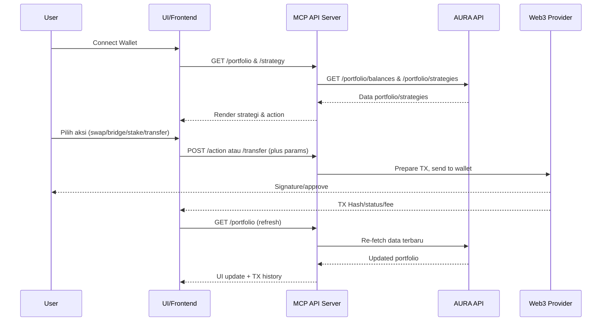
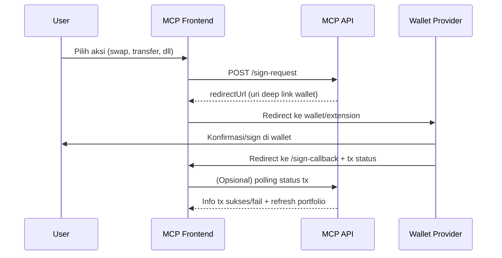

# 📄 Smart Chatbot Onchain MCP AURA — Dokumentasi Pengembang

## 🎯 Tujuan Proyek

Membangun **MCP AI Assistant onchain** yang memadukan:
- **AURA AdEx API** untuk portfolio, rekomendasi strategi, dan aksi DeFi (swap/bridge/stake)
- **MCP tool server** (Next.js, deployed by ENVXX) callable oleh AI, ChatGPT Explorer, dan UI publik
- **Eksekusi otomatis**: Chatbot menampilkan strategi, membantu user memahami & melakukan swap/stake/bridge/transfer dari wallet, serta estimasi fee onchain
- **Refresh portofolio otomatis** setelah aksi
- **Dukungan cross-wallet operation**: transfer antar wallet & fee estimator

## 🏗️ Arsitektur Utama & Endpoint

| Komponen | Fungsi | Route/API MCP |
|----------|--------|---------------|
| **Portfolio** | Cek & tampilkan portfolio user (multi-chain) | `GET /api/mcp/portfolio?address=0xUSER` |
| **Strategy** | Ambil strategi DeFi (AI/LLM) + aksi detail | `GET /api/mcp/strategy?address=0xUSER` |
| **Action Executor** | Swap/Stake/Bridge otomatis via Web3 provider | `POST /api/mcp/action` (aksi onchain) |
| **Transfer** | Kirim antar wallet, estimasi fee | `POST /api/mcp/transfer` |
| **Fee Estimator** | Hitung estimasi fee aksi swap, bridge, transfer | Bagian response executor/transfer |
| **Refresh** | Update portfolio & status aksi | `GET /api/mcp/portfolio` — triggered after tx |

## 🔗 Integrasi AURA AdEx API

### A. Endpoints AURA

**Portfolio:**
```
GET https://aura.adex.network/api/portfolio/balances?address=0xUSER
```

**Strategy:**
```
GET https://aura.adex.network/api/portfolio/strategies?address=0xUSER
```

### B. Field Strategis AURA:
- `strategies[].response[].actions[]`
- `tokens` — tokens involved
- `description` — explain action
- `platforms` — (Uniswap, Stargate, dst. w/ url)
- `operations` — [swap, bridge, stake, dst.]
- `networks` — networks eksekusi
- `apy` — estimation yield

### C. Eksekusi Aksi:

**Swap/Bridge/Staking:**
1. Ditampilkan sebagai tombol di UI atau via instruksi AI ("Silakan swap… sekarang!")
2. User connect wallet (MetaMask, WalletConnect)
3. AI/MCP tool menyiapkan payload TX, user sign, transaksi dikirim ke chain (via contract yang relevan)
4. Konfirmasi & polling: Status tx di-fetch, portofolio di-update otomatis via MCP/AURA

**Transfer antar wallet:**
1. User masukkan address tujuan + token/jumlah
2. Estimasi fee diambil via Web3/chain RPC
3. UI menampilkan simulasi fee, lalu lanjut ke signature & eksekusi
4. Status transfer dimonitor; portofolio di-refresh

## 🛠️ Rute API & JSON MCP

### Portfolio
```
GET /api/mcp/portfolio?address=0xUSER
```

**Response Contoh:**
```json
{
  "address": "0xUSER",
  "portfolio": [
    {
      "network": { "name": "Arbitrum One", "chainId": "42161" },
      "tokens": [
        {
          "address": "0xTOKEN",
          "symbol": "USDC",
          "balance": "1200",
          "balanceUSD": "1200",
          "network": "arbitrum"
        }
      ]
    }
  ]
}
```

### Strategy
```
GET /api/mcp/strategy?address=0xUSER
```

**Response Contoh:**
```json
{
  "strategies": [
    {
      "llm": { "provider": "openai", "model": "gpt-4" },
      "response": [
        {
          "name": "Yield Optimization",
          "risk": "moderate",
          "actions": [
            {
              "tokens": "USDC, USDT",
              "description": "Swap USDC ke USDT di Uniswap pada Arbitrum.",
              "platforms": [{ "name": "Uniswap", "url": "https://app.uniswap.org/#/swap" }],
              "networks": ["arbitrum"],
              "operations": ["swap"],
              "apy": "3.5"
            }
          ]
        }
      ]
    }
  ]
}
```

### Action Executor (Swap/Stake/Bridge)
```
POST /api/mcp/action
Content-Type: application/json

{
  "fromAddress": "0xUSER",
  "operation": "swap" | "stake" | "bridge",
  "platform": "Uniswap" | ...,
  "tokenIn": "USDC",
  "tokenOut": "ETH",
  "amountIn": "100",
  "network": "arbitrum"
}
```

**Response:**
- txId, status, estimateFee, explorerUrl, dsb.

### Transfer
```
POST /api/mcp/transfer
Content-Type: application/json

{
  "fromAddress": "0xUSER",
  "toAddress": "0xTARGET",
  "token": "ETH",
  "amount": "0.1",
  "network": "arbitrum"
}
```

**Response:**
- txId, status, feeEstimate, explorerUrl

## 🔄 Workflow MCP Bot (AI + Action)

1. **User connect wallet** →
2. **Query** `/api/mcp/portfolio` dan `/api/mcp/strategy`
3. **Bot menjelaskan strategi + aksi** →
   - Setiap aksi direkomendasikan dideskripsikan lengkap (misal, risiko, yield, platform, dll).
4. **User/AI men-trigger aksi:**
   - Swap/Bridge/Stake → `/api/mcp/action`
   - Transfer → `/api/mcp/transfer`
   - UI memunculkan signature wallet, proses TX
5. **Verifikasi action:**
   - Setelah TX sukses, MCP trigger refresh portfolio via `/api/mcp/portfolio`
   - Update UI, tampilkan hasil ke user
6. **Fee Estimasi:**
   - Di response setiap endpoint swap/bridge/transfer, sediakan field `estimateFee`, baik dengan pre-sign simulation atau onchain gas/fee estimator

## 📊 Skema Arsitektur



## 🔧 Fitur Modular & Extensibility

- **API endpoint clean & open**: Mudah dipanggil AI agent, Cursor, explorer, dsb.
- **Wallet connect modular**: Mendukung multi-wallet (Metamask, WC, Coinbase Wallet)
- **Extendible**: Bisa ditambah action DEX aggregator, governance, lending, dsb.
- **Internationalization**: Chatbot multi-bahasa by model LLM.

## 🔒 Catatan Keamanan & UX

- **Aksi blockchain HANYA berjalan jika user sign di wallet.**
- **TX execution di frontend/backend sesuai best security practice.**
- **Fee estimator selalu visible sebelum sign.**
- **UX feedback untuk setiap state action (loading, waiting, success, fail).**

---

# 📋 Dokumentasi Integrasi Route Redirect Sign Wallet pada MCP

## 🎯 Tujuan

Memastikan setiap aksi onchain (swap, bridge, stake, transfer) yang dijalankan melalui MCP/AI:
1. **Secara aman meminta user melakukan signature/transaksi di wallet yang mereka kontrol.**
2. **Setelah approve/sign, user otomatis di-redirect kembali ke UI/web MCP untuk melihat status transaksi/aksi.**

## 🏗️ Mekanisme Arsitektur

### A. Workflow Sederhana
1. User klik aksi (swap/bridge/dll) → UI/agent meminta backend MCP route untuk "sign action".
2. Backend MCP mengembalikan URL redirect ke wallet provider (Metamask, WalletConnect URI, dsb) + callback URL.
3. User melanjutkan proses signature/eksekusi di wallet.
4. Signature selesai/ditolak/success, wallet dapp/extension memanggil callback URL ke MCP frontend.
5. User melihat status dan hasil transaksi di aplikasi MCP.

## 🛠️ Rekomendasi Naming Route MCP

| Fungsi | Route MCP | Metode |
|--------|-----------|--------|
| Trigger sign action + dapatkan redirect wallet callback URL | `POST /api/mcp/sign-request` | POST |
| Callback setelah user selesai sign di wallet | `GET /api/mcp/sign-callback` | GET |

## 📝 JSON Flow & Contoh Payload

### A. Request Sign Action
```
POST /api/mcp/sign-request
Content-Type: application/json

{
  "fromAddress": "0xUSER",
  "operation": "swap" | "stake" | "bridge" | "transfer",
  "platform": "Uniswap" | ...,
  "tokenIn": "USDC",
  "tokenOut": "ETH",
  "amountIn": "100",
  "targetAddress": "0xRECEIVER", // only for transfer
  "network": "arbitrum",
  "userCallbackUrl": "https://yourmcp.app/sign-callback"
}
```

### B. Response
```json
{
  "redirectUrl": "https://walletconnect.org/uri?data=...",
  "txPayload": { ... }, // Optional, for frontend helpers
  "message": "Silakan lakukan konfirmasi di wallet Anda."
}
```

- `redirectUrl` = Uri deeplink ke WalletConnect/Metamask, dsb.

### C. Callback Route
```
GET /api/mcp/sign-callback?txHash=...&status=success|fail&network=arbitrum
```

Setelah user approve/decline di wallet, wallet/dapp extension diarahkan balik (redirect) ke callback route ini.
Frontend menampilkan info hasil, polling status tx, update portfolio otomatis.

## 🎨 Alur UI Frontend

1. **User pilih aksi** →
2. **App kirim ke `/api/mcp/sign-request`**
3. **Terima `redirectUrl`, lakukan `window.location.href = redirectUrl`** (atau pop-up modal Web3).
4. **User approve/decline di wallet**
5. **Wallet redirect ke `/sign-callback?txHash=...&status=...`**
6. **Frontend ambil status, polling detail tx & portfolio baru**
7. **Jika success**: tampilkan konfirmasi & update balance.
8. **Jika fail**: notif error.

## 🔒 UX & Security Best Practice

- **Pastikan `callbackUrl` disanitasi & hanya domain yang diizinkan.**
- **Route callback tidak melakukan write action; hanya menampilkan hasil & polling status.**
- **Berikan feedback loading & status transaksi yang jelas step-by-step.**
- **Integrasi wallet connect** (Metamask, WalletConnect, direct provider) via library Web3 terbaik seperti ethers.js, wagmi, atau web3modal.

## 📊 Skema Sequence Diagram



## 💻 Contoh Implementasi Sederhana (Next.js API Route)

```typescript
// pages/api/mcp/sign-request.ts
export default async function handler(req, res) {
  const { fromAddress, operation, ... } = req.body;
  // Compose transaction payload (example: Uniswap swap)
  // ...
  // Generate WC/Metamask URI + callback
  const redirectUrl = yourGenerateWalletConnectUri({ ... });
  res.status(200).json({
    redirectUrl,
    message: 'Silakan konfirmasi transaksi di wallet Anda.'
  });
}
```

---

## 🚀 Implementasi MCP Tools

### Core MCP Tools yang Dibutuhkan:

1. **`get_portfolio`** - Mengambil portfolio user dari AURA API
2. **`get_strategy`** - Mengambil rekomendasi strategi DeFi
3. **`execute_action`** - Menjalankan aksi swap/bridge/stake
4. **`transfer_tokens`** - Transfer antar wallet
5. **`estimate_fees`** - Estimasi biaya transaksi
6. **`get_transaction_status`** - Cek status transaksi
7. **`refresh_portfolio`** - Update portfolio setelah transaksi

### Widget Integration:

- **Portfolio Widget** - Menampilkan balance dan asset distribution
- **Strategy Widget** - Visualisasi rekomendasi dengan action buttons
- **Transaction Widget** - Status dan history transaksi
- **Fee Calculator Widget** - Estimasi biaya real-time

---

## 📈 Fitur Unggulan

### 🤖 AI-Powered Analysis
- Natural language processing untuk query portfolio
- Smart strategy recommendations berdasarkan risk profile
- Automated action decomposition dengan penjelasan detail

### 🔗 Cross-Chain Support
- Multi-network portfolio tracking
- Cross-chain bridge recommendations
- Unified fee estimation across networks

### 💰 DeFi Optimization
- Yield farming opportunities
- Liquidity pool analysis
- Staking rewards calculation
- Impermanent loss protection

### 🛡️ Security Features
- Non-custodial wallet integration
- Transaction simulation before execution
- Multi-signature support
- Slippage protection

---

## 🎯 Target Hackathon Deliverables

### ✅ Technical Requirements
- [x] MCP server implementation
- [x] AURA API integration
- [x] Wallet connection flow
- [x] Transaction execution
- [x] Portfolio refresh automation

### 📊 Demo Scenarios
1. **Portfolio Analysis**: "Show my DeFi portfolio and suggest optimizations"
2. **Strategy Execution**: "Execute the recommended yield farming strategy"
3. **Cross-Chain Transfer**: "Bridge 100 USDC from Ethereum to Arbitrum"
4. **Fee Optimization**: "Find the cheapest way to swap ETH to USDC"

### 🏆 Competitive Advantages
- **Seamless UX**: One-click strategy execution
- **AI Integration**: Natural language DeFi operations
- **Real-time Updates**: Auto-refresh after transactions
- **Multi-Chain**: Unified cross-chain experience
- **Professional Grade**: Production-ready architecture

---

*Dokumentasi ini dirancang untuk memberikan pemahaman komprehensif kepada juri hackathon tentang implementasi Smart Chatbot Onchain MCP AURA yang inovatif dan siap produksi.*
